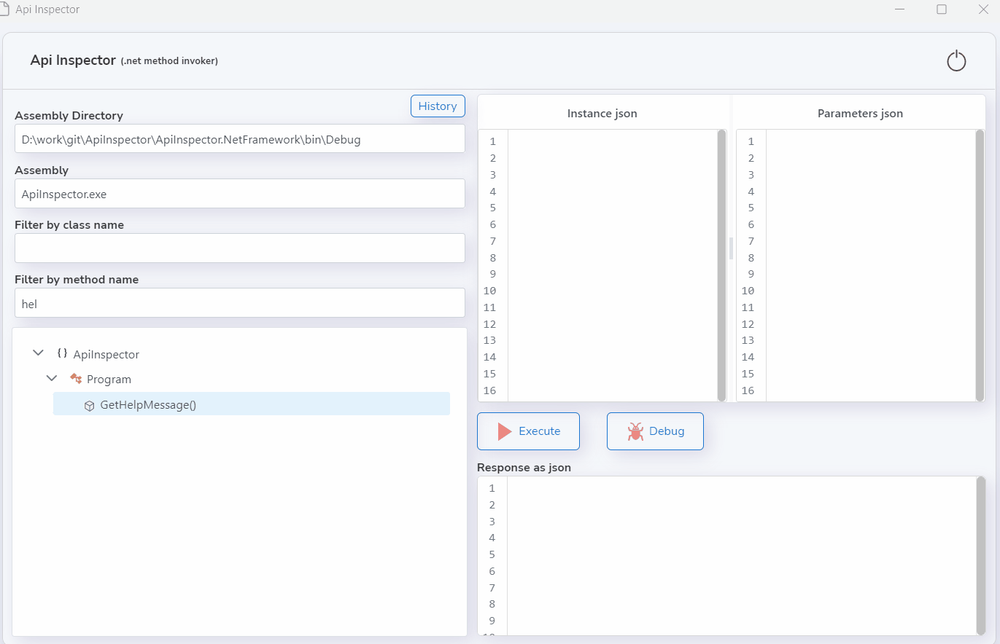
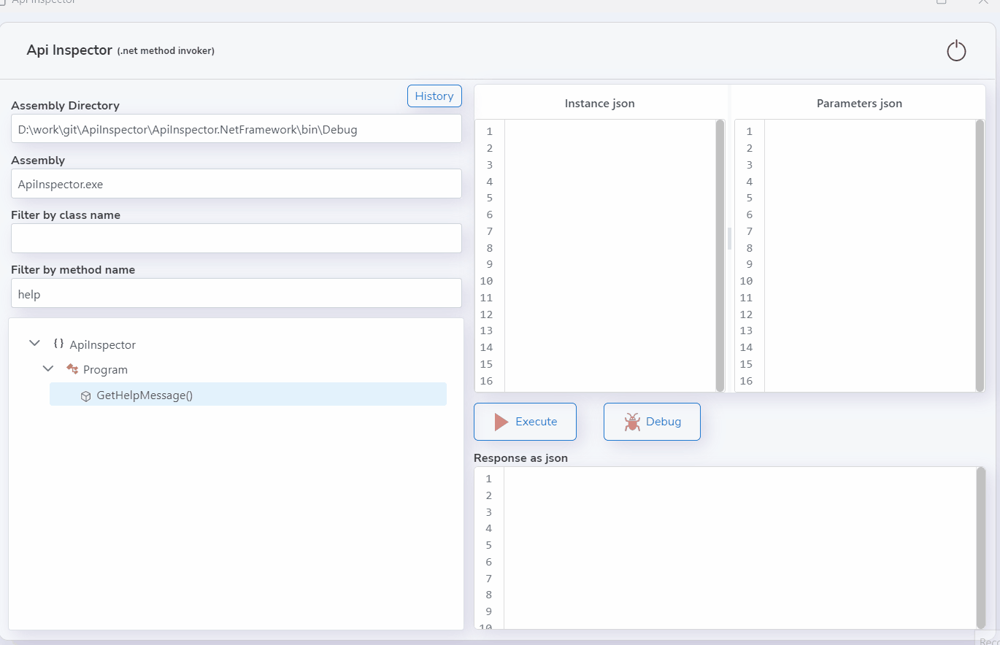

# ApiInspector
Simple .net method invoker - debugger.

Select any method from left panel
then invoke selected method with specific parameters.

You can quickly run or debug your methods by this tool.

Press 'Debug' button then attach to process 'ApiInspector' from your ide.

<a id="raw-url" href="https://github.com/beyaz/ApiInspector/releases/download/LatestVersion/ApiInspector.zip">Download</a>

Note: Minimum required platform is '.Net 7.0'.

https://dotnet.microsoft.com/en-us/download/dotnet/7.0

.net Core 7 SDK

>Note: if there is an error like '..Unable to configure HTTPS endpoint. No server certificate was specified...'\
>You can  fix:\
>dotnet dev-certs https --trust
>dotnet dev-certs https --clean\
>dotnet dev-certs https --verbose

## Screenshots

